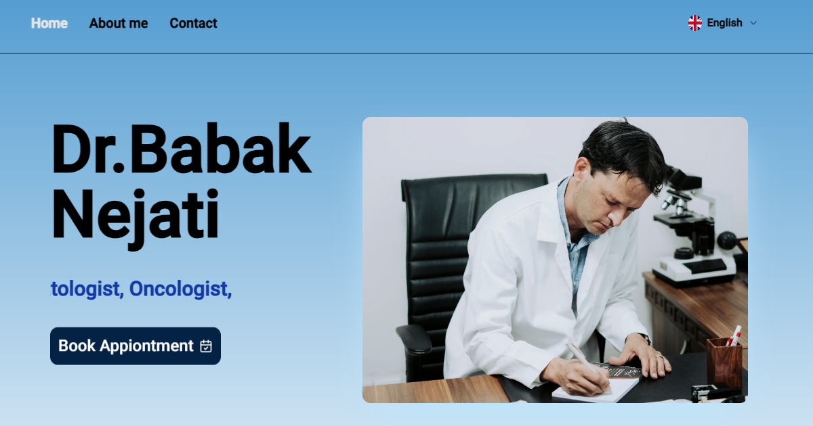

# Multilingual Oncologist Website

This is a **multilingual** and **responsive** website built for an oncologist using **Next.js**. It supports three languages—**Persian, English, and Turkish**—and provides essential information about the oncologist, including office location and practice statistics. The project is designed to be **scalable** and will be updated with new features over time.

## Screenshots


## 🛠 Features

- 🌐 **Multilingual Support**: Persian, English, and Turkish.
- 📱 **Responsive Design**: Adapts to all screen sizes.
- 📋 **Basic Information**: Displays the oncologist’s details and background.
- 🗺 **Location & Contact**: Integrated Neshan Maps for displaying the office location.
- 📊 **Statistics**: Relevant practice statistics.
- 🚀 **Scalable**: Future-proof design with planned updates and new features.

## 🚀 Technologies Used

- **Next.js**: React-based framework for building fast web applications.
- **i18n**: For internationalization and multilingual support.
- **Tailwind CSS**: Utility-first CSS framework for custom, responsive designs.
- **ShadCN UI**: Modern UI components for building stylish interfaces.
- **Neshan Maps Platform**: For map integration and displaying the office location.

## ⚙️ Installation & Setup

To run this project locally, follow these steps:

1. **Clone the repository:**

    ```bash
    git clone <git@github.com:Babak-Taghizadeh/Dr-Nejati.git>
    ```

2. **Navigate to the project directory:**

    ```bash
    cd <Dr-Nejati>
    ```

3. **Install the dependencies:**

    ```bash
    npm install
    ```

4. **Run the development server:**

    ```bash
    npm run dev
    ```

5. Open [http://localhost:3000](http://localhost:3000) to view the website.

## 🌍 Multilingual Support

This project uses **i18n** for multilingual support. Currently, it supports:

- Persian
- English
- Turkish

To add new languages, update the translation files in the `locales` directory.

## 🗺 Map Integration

The project uses **Neshan Maps Platform** for map functionality. To set it up:

1. Get an API key from [Neshan Maps Platform](https://neshan.org/).
2. Add your API key to the `.env.local` file:

    ```bash
    NEXT_PUBLIC_NESHAN_MAPS_API_KEY=your_api_key
    ```


## 📜 License

This project is licensed under the MIT License.

---

## 📞 Contact

For inquiries, you can reach out via [babak.tz98@gmail.com].
